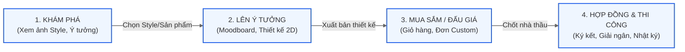

# Phân tích UX/UI & Đề xuất Thiết kế Hệ sinh thái "Khám phá & Lên ý tưởng"

Hệ thống **ConstructX** là một nền tảng tiên tiến kết hợp giữa thương mại điện tử nội thất, công cụ tự thiết kế không gian và sàn đấu thầu thi công. Tài liệu này cung cấp bản phân tích UX/UI chuyên sâu và đề xuất thiết kế chi tiết cho module **Khám phá & Lên ý tưởng (Exploration & Ideation)**, đồng thời thiết lập sợi chỉ đỏ trải nghiệm (seamless user journey) kết nối phân hệ này với **Trang chủ**, **Cửa hàng**, **Thiết kế 2D** và **Hệ thống Quản lý Đơn hàng & Hợp đồng** đã phân rã.

---

## 1. Tầm nhìn UX/UI: Sợi chỉ đỏ Trải nghiệm Khách hàng

Một trong những thách thức lớn nhất của các ứng dụng TMĐT và thiết kế là sự đứt gãy trải nghiệm giữa **cảm hứng (inspiration)** và **thực thi (execution)**. Người dùng thường xem ảnh đẹp trên Pinterest, tự vẽ trên một công cụ khác, đi mua đồ ở một cửa hàng thứ ba, và tìm thợ thi công ở ngoài đời thực.

**ConstructX giải quyết triệt độ vấn đề này bằng một hành trình khép kín:**



---

## 2. Phân tích & Đề xuất Thiết kế Chi tiết từng Phân hệ

### Phân hệ A: Khám phá & Lên ý tưởng (Ý tưởng & Phong cách - `/explore` [NEW])

Phân hệ này đóng vai trò là phễu đón khách hàng (nguồn cảm hứng), giúp họ định hình phong cách nội thất mong muốn (Scandinavian, Japandi, Indochine, Modern Minimalist).

#### 1. UX (Trải nghiệm người dùng):
* **Pinterest-style Masonry Grid:** Hiển thị danh sách hình ảnh thiết kế chất lượng cực cao dưới dạng lưới bất đối xứng giúp kích thích thị giác.
* **Interactive Hotspots (Điểm chạm tương tác):** Khi click vào một ảnh phòng khách, trên ảnh xuất hiện các chấm tròn nhỏ phát sáng (glowing hotspots) đính vào các món đồ (Sofa, đèn trần, bàn trà). 
  * Click vào hotspot sẽ hiện popup nhỏ chứa thông tin sản phẩm: tên, giá, nút "Mua ngay" hoặc "Tự tùy chỉnh kích thước".
* **Moodboard Builder (Bảng ý tưởng):** Cho phép kéo thả các hình ảnh sản phẩm, mã màu, chất liệu gỗ vào một khung vải trắng để tự tạo bảng phối cảnh riêng trước khi thiết kế chi tiết.

#### 2. UI (Giao diện người dùng):
* **Style Filters:** Thanh lọc phong cách dạng viên thuốc (pill tabs) bo tròn mềm mại ở đầu trang.
* **Visual Cards:** Thẻ hình ảnh có hiệu ứng hover phóng to nhẹ (`scale-102`), phủ một lớp gradient đen mờ ở đáy chứa tên phong cách và tên nhà thiết kế/nhà thầu tạo ra tác phẩm đó.
* **Hotspot UI:** Các chấm tròn màu trắng bán trong suốt có hiệu ứng ripple (sóng tròn lan tỏa) để thu hút sự chú ý của người dùng mà không làm che mất vẻ đẹp của bức ảnh.

---

### Phân hệ B: Trang chủ (Home Page - `/`)

Trang chủ là điểm khởi đầu, cần điều hướng khách hàng nhanh chóng đến các phân khu chức năng dựa trên nhu cầu thực tế của họ.

#### 1. UX (Trải nghiệm người dùng):
* **Personalized Entryways:** Phân chia rõ ràng lối vào cho 3 nhóm nhu cầu chính:
  1. *"Tôi cần tìm cảm hứng & ý tưởng"* -> Dẫn tới `/explore`.
  2. *"Tôi muốn tự thiết kế căn hộ của mình"* -> Dẫn tới `/shop/designer`.
  3. *"Tôi muốn mua đồ nội thất có sẵn"* -> Dẫn tới `/shop`.
* **Reputation & Trust Showcase:** Hiển thị các nhà thầu có điểm uy tín AI Trust Score cao nhất kèm hình ảnh công trình thực tế họ đã hoàn thành.

#### 2. UI (Giao diện người dùng):
* **Hero Section:** Sử dụng hình ảnh không gian nội thất 3D panorama siêu rộng, tiêu đề lớn tinh tế viết bằng font chữ hiện đại (Outfit), nút kêu gọi hành động (CTA) nổi bật với hiệu ứng bóng mờ sang trọng.
* **Glassmorphism Search Hub:** Thanh tìm kiếm thông minh dạng kính mờ (backdrop-blur) nổi trên hình nền Hero, cho phép tìm kiếm chéo sản phẩm, phong cách thiết kế hoặc nhà thầu thi công.

---

### Phân hệ C: Cửa hàng nội thất (Furniture Shop - `/shop`)

Cửa hàng là nơi chuyển hóa cảm hứng thành doanh thu bán hàng trực tiếp (Catalog Orders).

#### 1. UX (Trải nghiệm người dùng):
* **"Shop the Look" Integration:** Khách hàng có thể mua nguyên một combo phòng ngủ hoặc phòng khách đã được phối cảnh sẵn trong mục Khám phá chỉ bằng 1 nút bấm "Mua trọn bộ" (được giảm giá combo).
* **Dimensional Customization Toggle:** Đối với các sản phẩm catalog, tích hợp nút *"Yêu cầu sản xuất theo kích thước riêng"*. Nút này sẽ tự động chuyển cấu hình sản phẩm sang dạng đơn hàng Custom để mở thầu gia công.

#### 2. UI (Giao diện người dùng):
* **Premium Product Grid:** Lưới sản phẩm tối giản, khoảng cách (gap) rộng rãi tạo cảm giác thoáng đãng, sang trọng.
* **Smart Badges:** Các góc ảnh sản phẩm có tag nhỏ gọn như: `Best Seller`, `Có thể tùy chỉnh kích thước`, `Freeship`. Mức giá hiển thị rõ ràng, font đậm màu lục primary `#1a4f3a`.

---

### Phân hệ D: Thiết kế 2D (2D Planner - `/shop/designer`)

Công cụ kỹ thuật giúp người dùng tự tay vẽ sơ đồ mặt bằng và sắp xếp nội thất trong không gian nhà mình.

#### 1. UX (Trải nghiệm người dùng):
* **Template Importing:** Người dùng có thể chọn một căn phòng mẫu từ mục "Khám phá ý tưởng" và nhập trực tiếp bố cục đó vào công cụ thiết kế 2D để chỉnh sửa lại, không cần vẽ từ đầu.
* **Auto Shopping List Generator:** Khi người dùng sắp xếp đồ đạc trong bản vẽ, hệ thống tự động bóc tách và tạo một giỏ hàng tương ứng gồm các sản phẩm catalog sẵn có.
* **One-Click Custom Bidding:** Đối với các đồ gỗ đo đạc theo kích thước tường (như tủ quần áo âm tường, tủ bếp), người dùng nhấn nút *"Gửi báo giá sản xuất"*. Bản vẽ kỹ thuật 2D sẽ được tự động đính kèm vào Đơn hàng Custom để các nhà thầu vào đấu giá.

#### 2. UI (Giao diện người dùng):
* **Pro-tool Dark/Light Mode Interface:** Thiết kế bảng điều khiển mỏng (slim panels), các icon vector sắc nét, lưới nền (grid canvas) hiển thị kích thước trực quan.
* **Interactive Tooltips:** Khi di chuột vào từng nút công cụ (vẽ tường, thêm cửa, đặt sofa), hiển thị bong bóng chỉ dẫn động ngắn gọn, sinh động.

---

### Phân hệ E: Quản lý Đơn hàng & Hợp đồng (Đã phân rã độc lập)

Đây là giai đoạn thực thi giao dịch tài chính và thi công sau khi khách hàng đã chọn xong sản phẩm hoặc nhà thầu. 

**Mô hình phân rã UX/UI chúng ta vừa xây dựng giải quyết hoàn hảo luồng này:**

```
[Quản lý Đơn hàng (/orders)]
    ├── Tab 1: Đơn hàng Catalog (Đơn giản, mua thẳng từ Shop)
    └── Tab 2: Đơn hàng Custom (Có Bảng đấu giá bảo mật)
            │
            └── 🔗 CẦU NỐI THÔNG MINH (Smart Contract Bridge)
                    │
                    └───> [Hợp đồng của tôi (/contracts)] (Phân rã thành 4 Page chuyên biệt)
                              ├── Page 1: 📊 Tiến độ & Nhật ký thi công (/progress)
                              ├── Page 2: 💰 Giải ngân & Ví đóng băng Escrow (/disbursements)
                              ├── Page 3: 🏆 Nghiệm thu hoàn công & Đánh giá đa tiêu chí (/review)
                              └── Page 4: 🛡️ Giải quyết Tranh chấp & Khiếu nại (/dispute)
```

#### 🌟 Điểm sáng UX vượt trội của thiết kế phân rã Hợp đồng:
* **Tập trung nhận thức (Cognitive Focus):** Khi khách hàng muốn kiểm tra xem thợ hôm nay làm gì, họ vào `/progress` và chỉ nhìn thấy ảnh công trường, không bị xao nhãng bởi các con số tài chính. Khi họ cần giải ngân tiền, họ vào `/disbursements` và chỉ tập trung vào quy trình 5 bước an toàn.
* **Luồng pháp lý chặt chẽ:** Trang `/review` chỉ mở form đánh giá và nghiệm thu khi tiến độ đạt 100%. Trang `/dispute` đóng vai trò là van an toàn, lập tức khóa mọi dòng tiền trên các trang khác khi có khiếu nại, tạo sự an tâm tuyệt đối cho cả khách hàng và nhà thầu.

---

## 3. Thiết kế Giao diện UI/UX Tổng thể (Design System)

Để tạo nên một giao diện đẳng cấp cao (premium aesthetic), chúng tôi thiết lập bộ quy chuẩn thiết kế sau:

### 1. Bảng màu thương hiệu (Color Palette):
* **Primary (Xanh lục đại ngàn):** `#1a4f3a` (Đại diện cho sự vững chãi, uy tín, sinh khí của ngôi nhà).
* **Secondary (Vàng cát ấm):** `#d97706` hoặc màu vàng champagne (Tạo điểm nhấn sang trọng, ấm cúng).
* **Backgrounds (Màu nền organic):** Sử dụng các tông màu xám ấm (warm grey) và màu vỏ sò nhẹ nhàng thay cho màu trắng tinh đơn điệu để tạo chiều sâu và cảm giác cao cấp.
* **Semantic Colors (Màu chức năng):** Xanh dương dịu cho thông báo, đỏ gạch cho tranh chấp/hủy đơn, xanh lá nhạt cho giải ngân thành công.

### 2. Typography (Font chữ):
* **Font Tiêu đề:** Sử dụng font **Outfit** (Google Fonts) - một font chữ geometric sans-serif hiện đại, thanh lịch và cực kỳ sắc nét.
* **Font Nội dung:** Sử dụng font **Inter** - font chữ tối ưu hóa cho hiển thị văn bản số, bảng biểu và giao diện điều khiển kỹ thuật.

### 3. Micro-animations (Hiệu ứng chuyển động nhỏ):
* **Tab transitions:** Khi chuyển đổi giữa các tab (Catalog/Custom hoặc 4 tab hợp đồng), thanh trượt nền (active indicator slider) di chuyển mượt mà dưới chân chữ thay vì biến mất đột ngột.
* **Hotspot Pulsing:** Điểm chạm trên ảnh cảm hứng có hiệu ứng sóng tròn lan tỏa vô chậm (`animate-ping` kết hợp opacity nhẹ).
* **Scale on Hover:** Các thẻ sản phẩm, thẻ ý tưởng phóng to nhẹ 2% kèm bóng mờ đổ xuống sâu hơn khi di chuột qua (`transition-all duration-350 ease-out`).
